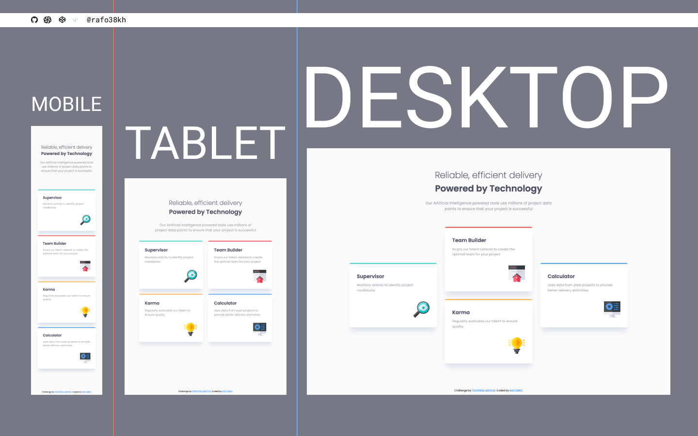

# Frontend Mentor - Four Card Feature Section Solution

This is a solution to the [Four Card Feature Section Solution Challenge on Frontend Mentor](https://www.frontendmentor.io/challenges/four-card-feature-section-weK1eFYK)

## Table of contents

- [Overview](#overview)
  - [The challenge](#the-challenge)
  - [Screenshot](#screenshot)
  - [Links](#links)
- [My process](#my-process)
  - [Built with](#built-with)
- [Author](#author)

## Overview

### The challenge

Users should be able to:

- View the optimal layout for the site depending on their device's screen size

### Screenshot

### Links

- Solution URL: [https://www.frontendmentor.io/solutions/four-card-feature-section-with-scss-bem-css-grid-and-flexbox-x1D0Ix1sv](https://www.frontendmentor.io/solutions/four-card-feature-section-with-scss-bem-css-grid-and-flexbox-x1D0Ix1sv)
- Live Site URL: [https://rafo38kh.github.io/four-card-feature-section/](https://rafo38kh.github.io/four-card-feature-section/)

## My process

### Built with

- Semantic HTML5 markup
- SCSS custom properties
- CSS Flexbox
- CSS Grid
- Mobile-first workflow

## Author

- Frontend Mentor - [@rafo38kh](https://www.frontendmentor.io/profile/rafo38kh)
- GitHub - [@rafo38kh](https://github.com/rafo38kh)
- Codewars - [@rafo38kh](https://www.codewars.com/users/rafo38kh)
